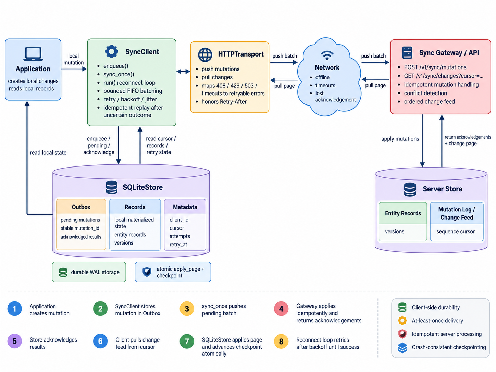

# Sync SDK

Send data collected offline to a central database.

Your app chooses the database, tables, fields, and access rules. This SDK saves
changes on the device, sends them when a connection is available, and tries again
when sending fails. It can also bring server changes back to the device.

## How it works



1. Your app adds a change to a local queue, called the **outbox**.
2. The SDK saves that change before returning to your app.
3. The client sends queued changes to the **gateway**, the server part of the SDK.
4. The gateway checks the data and writes it to the tables you chose.
5. The client saves the result and its place in the server change list.
6. After a restart, the client continues from that saved place.

Each change has its own ID. Sending that same change again does not apply it twice.

## Try the example

From this project folder, run:

```sh
uv sync --extra gateway
uv run --extra sqlite python examples/pluggable_tasks.py
```

The example creates a task table, sends one task through the pipeline, and prints
the saved data. It uses temporary files and removes them when it finishes.

See [the example code](examples/pluggable_tasks.py).

## Choose what to install

Install only the parts your app needs. From this project folder:

```sh
# HTTP, FastAPI, and PostgreSQL support
pip install '.[http,fastapi,postgres]'

# HTTP, FastAPI, and SQLite support
pip install '.[http,fastapi,sqlite]'
```

The base package needs Pydantic, which checks data types. The local SQLite queue
uses Python's built-in SQLite support.

You supply the database connection. For MySQL, install the SQLAlchemy driver your
app uses. The SDK does not choose your database or manage its login details.

## Choose your tables and fields

You can use new tables or tables your app already has. This example uses SQLAlchemy
to describe a table:

```python
from sqlalchemy import Column, Integer, MetaData, String, Table
from sync_sdk.adapters.sqlalchemy_config import SQLAlchemyConfig

metadata = MetaData()
tasks = Table(
    "my_tasks", metadata,
    Column("id", Integer, primary_key=True),
    Column("title", String(200), nullable=False),
    Column("private_note", String(200), server_default="private"),
)

config = SQLAlchemyConfig()
task_binding = config.register_table(
    "tasks", tasks, fields={"title": "title"},
)
```

Here is what each part means:

- `my_tasks` is the database table name.
- `tasks` is the name your app uses when sending a change.
- `id` identifies a row.
- `fields` chooses which values to send and which columns receive them.
- `private_note` stays in the database. It is not sent through sync.

In `fields={"title": "title"}`, the left name is the data field and the right name
is the database column. The names can differ.

If you leave out `fields`, every column except the row's key is included. You can
also pass an existing model's table, such as `Task.__table__`.

## Create the tables and build the gateway

Run this inside your async app. `engine` is your SQLAlchemy database connection
manager. `sessions` is your app's async session factory, which opens database
sessions. The [example](examples/pluggable_tasks.py) shows how to create both.

```python
await config.create_tables(engine)
gateway = config.build(sessions)
```

`register_table()` and `build()` do not change the database.

`create_tables()` creates the tables you registered and the SDK's tracking tables.
It leaves existing tables alone. It does not add columns to an existing table or
create other tables that you did not register.

Run table setup before starting sync workers. Use your app's database migration
tool when you need to change an existing table.

If your app already creates its own tables, create only the SDK tracking tables:

```python
from sync_sdk.adapters.sqlalchemy import initialize_sync_metadata

await initialize_sync_metadata(engine)
```

## Add sync routes to your app

For FastAPI:

```python
from sync_sdk.integrations.fastapi import create_sync_router

app.include_router(create_sync_router(lambda: gateway, prefix="/v1/sync"))
```

Your app must check who can use these routes. A gateway returns all changes in its
configured data store. Registering tables does not separate one user's data from
another user's data. Use separate stores or an adapter that checks data access.

## Send offline data

Run this inside your async app, using the `tasks` gateway shown above:

```python
import httpx
from sync_sdk import SQLiteStore, SyncClient
from sync_sdk.adapters.http import HTTPTransport

with SQLiteStore("device.db", client_id="device-1") as local:
    async with httpx.AsyncClient(base_url="http://localhost:8000", timeout=10) as http:
        sync = SyncClient(local, transport=HTTPTransport(http))
        sync.enqueue(
            entity="tasks", entity_id="1", operation="create",
            payload={"title": "Offline edit"}, base_version=0,
        )
        report = await sync.sync_once()
        print(report, local.results())
```

`enqueue()` saves one new change. Call it once for each change your app makes.
Do not call it again just because sending failed.

`sync_once()` sends and receives a limited amount of data, then returns.
`await sync.run()` keeps checking and sending until you cancel it.

Reopen the same local file with the same client ID after a restart. The SDK keeps
pending changes and the saved place in the server change list.

Use one sync worker per local file, on the thread that opened it. Use a different
file for each client and server data store. Your app opens and closes connections
and chooses timeouts.

You can also use `DirectTransport(gateway)` from `sync_sdk.adapters.direct` to call
the gateway in the same process, without HTTP. `SyncClient(local, http)` still works
as a shorter way to choose HTTP.

## Data checks and row versions

The table setup creates basic data checks from the columns you selected. It checks
types, checks whether `None` is allowed, and rejects extra fields. It can fill in
simple Python default values. Pass `schema=YourPydanticModel` to set your own checks.

Send all selected fields for a create or update. A create or update adds the row
if it is missing and changes it if it already exists.

`base_version` is the row version your app last knew about. If it differs from the
server version, the gateway returns a conflict instead of applying the change.
If you leave it out, the default policy skips this check. Deleting a row does not
erase its saved version.

`local.results()` returns saved results: `applied`, `conflict`, or `rejected`.
Conflicts and rejected changes are not sent again automatically. Your app decides
how to fix them and sends a new change with a new ID.

## Failed connections and saved progress

Failed connections, HTTP 408/429, and server errors cause a retry. The wait grows
after repeated failures, up to the configured limit. A small random amount helps
clients avoid retrying at the same time. A server's `Retry-After` header can make
the wait longer. The wait time is saved across restarts. Other errors are raised
for your app to handle.

Each sync call sends and receives at most `max_batches` groups in each direction.
The next call continues the work.

Received rows, deletes, and the saved position are written together. The local
record view shows data received from the server. It does not show pending edits
as if the server had already accepted them.

## What is included

- A local SQLite queue and record view.
- A SQLAlchemy adapter for your own tables. An **adapter** connects the pipeline
  to a chosen database or way of sending data.
- HTTP and direct calls within the same process.
- FastAPI routes you can add to your app.
- Rules that let developers write other storage and transport adapters.

Tests use a real SQLite database. The SQL table definitions are also checked for
PostgreSQL and MySQL, but live tests for those databases still need to be added.
There is no ready-to-use MongoDB or other NoSQL adapter yet.

See [the setup and adapter guide](docs/approach_architecture.md) for keys made from
several columns, linked tables, custom types, and rules for writing adapters.

## What your app still handles

Your app owns login checks, data access, table changes, and how long to keep saved
sync results.

Existing rows are not sent automatically. Writes made directly to the database
are not picked up automatically either. Send changes through the pipeline, or
add a way to record those outside writes. A row with no sync history starts at
sync version zero.

Changes made by database triggers or automatic linked-row deletes are also not
added to sync on their own.

## Run the sample server

The `app/` folder is a sample server. It registers `task` and uses its sample record
table. Your app does not need to use that table or import this folder.

Update its database, then start it:

```sh
uv run --extra gateway alembic upgrade head
uv run --extra gateway uvicorn app.main:app --reload
```

The database update keeps existing sync results, versions, and saved positions.

Run the tests:

```sh
uv run pytest -q
```

Tests cover retries, repeated sends, conflicts, table setup, linked tables, failed
writes, restarts, and a process stopping during a write. They do not simulate a
physical power failure.
